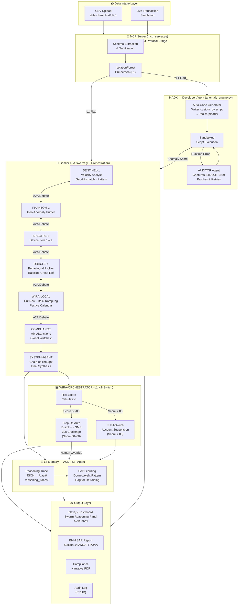

# 🛡️ WIRA.IO — *Where Intelligence Renders Action*
### Autonomous Multi-Agent Fraud Orchestration for Malaysian Banks

> **A live, self-healing AI swarm that investigates fraud, debates findings, writes its own detection code, and files BNM-compliant reports — all without a single human touch.**

[](https://wira-io.vercel.app/)
[](https://github.com/enthongy/wira-io)
[](https://nextjs.org/)
[](https://aistudio.google.com/)
[](https://www.bnm.gov.my/)

Powered by **Google Gemini 1.5 Flash · MCP · ADK · A2A Protocol · Scikit-learn**  
BNM Compliant · AMLATFPUAA Section 14 · PCI-DSS · PDPA

---

## ⚡ Quick Demo

**🌐 Live:** [https://wira-io.vercel.app/](https://wira-io.vercel.app/)

| Login | Role | Password | OTP |
|---|---|---|---|
| **Ahmad** | Investigator | any 6+ chars | any 6 digits |
| **Siti** | Lead Auditor | any 6+ chars | any 6 digits |

> Hit **"Simulate Live Feed"** after login to watch the AI swarm debate in real time.

---


## 🖼️ Functional Diagram


---

## 🗺️ System Architecture — A2A Agent Flow



---

## 🤖 Agent Roster & A2A Debate Protocol

Every transaction triggers an independent **multi-agent debate** — 2–3 randomly selected specialist agents investigate in parallel before a consensus verdict is reached.

### Agent Specialisations

| Agent | Codename | Specialty | Signal Detected |
|---|---|---|---|
| **Sentinel-1** | `SENTINEL_01` | Velocity Analyst | Location mismatch, unusual hours, transaction velocity spikes |
| **Phantom-2** | `PHANTOM_02` | Geo-Anomaly Hunter | Cross-border origin, geographic inconsistencies |
| **Spectre-3** | `SPECTRE_03` | Device Forensics | Device trust score < 30 (compromised), < 50 (unverified) |
| **Oracle-4** | `ORACLE_04` | Behavioural Profiler | Amount baseline profiling, foreign transaction detection |
| **WIRA-LOCAL** | — | Malaysian Context | DuitNow micro-payments, Balik Kampung travel, festive calendar |
| **COMPLIANCE** | — | AML/Sanctions | AMLATFPUAA S.14 watchlist (jewellery, forex, crypto, pawnshop) |
| **AUDITOR** | — | Conflict Resolver | Detects and resolves contradictions between agents, writes reasoning traces |
| **SYSTEM** | — | Final Synthesis | Chain-of-Thought composite risk score → ORCHESTRATOR |

### Consensus Mechanism

```
2-3 agents investigate independently
        ↓
Each produces: verdict + confidence + reasoning chain
        ↓
Consensus = most severe verdict wins (majority-critical rule)
        ↓
Composite risk score computed → ORCHESTRATOR
```

No agent acts alone. The final verdict is always the **result of autonomous multi-agent consensus**.

---

## 🛠️ ADK (Agent Development Kit) & MCP

### 🔗 MCP — Model Context Protocol

`tools/mcp_server.py` is the **secure data bridge** between raw CSV data and the Gemini AI agents:

| MCP Tool | Description |
|---|---|
| `get_transaction` | Fetch single transaction by ID |
| `get_random_sample` | Random transaction batch for simulation |
| `get_high_risk` | Filter by amount threshold (default: RM500+) |
| `get_by_category` | Transactions by merchant category |
| `get_flagged_fraud` | All `is_fraud == 1` labelled records |

- Raw CSV **never** passes directly to the LLM — MCP extracts schema, sanitises PAN data, and passes only structured metadata
- Runs the L1 `IsolationForest` anomaly pre-screen locally (millisecond latency, zero external API call)
- Returns sanitised anomaly scores + schema context tokens to the agent swarm

### ⚙️ ADK — Auto-Code Generation

WIRA.IO does not rely on pre-compiled detection logic. `tools/anomaly_engine.py` functions as a **Developer Agent**:

| Capability | Implementation |
|---|---|
| **Auto-Code Generation** | Reads incoming CSV headers → infers numeric schema → **writes a custom scikit-learn `.py` detection script** saved to `tools/uploads/` — bespoke per dataset |
| **Autonomous Debugging** | Monitors script `STDOUT` → if runtime error occurs, self-healing fallback regenerates a robust NaN-safe version and retries automatically |
| **Zero-Day Portfolio Handling** | No retraining required — every new dataset gets a freshly written detector script |

> **🎯 Demo**: Upload any CSV via the dashboard → check `tools/uploads/generated_analysis.py`

### Tiered Inference Architecture

| Tier | Layer | Technology | Role |
|---|---|---|---|
| **L1** | Edge | Python `IsolationForest` | Millisecond anomaly pre-screen via MCP. Zero external API calls. |
| **L2** | Orchestration | Gemini 1.5 Flash (CoT) | A2A Chain-of-Thought debate between specialist agents |
| **L3** | Memory | AUDITOR Reflection | Human overrides → JSON reasoning traces → local context downweighting |

---

## 🔒 System Robustness

### Risk Score Thresholds

| Score | Verdict | Action |
|---|---|---|
| **> 80** | `CRITICAL` | 🔴 Kill-Switch — autonomous account suspension, no human required |
| **50–80** | `FLAGGED` | 🟡 Step-Up Auth — DuitNow/SMS challenge, 30s human-in-the-loop window |
| **< 50** | `CLEAN` | ✅ Proceed — composite risk within acceptable range |

### Guardrails & Safety Layers

| Mechanism | Trigger | Behaviour |
|---|---|---|
| **🔴 Kill-Switch** | `risk_score > 80` | Autonomous account suspension. Toast + audit log fired. |
| **🟡 Step-Up Auth (HITL)** | `risk_score 50–80` | DuitNow/SMS challenge. 30s window. Human-in-the-loop before block. |
| **⚡ Circuit Breaker** | API unavailability | "Force Static Rules" toggle — instantly reverts to deterministic `IsolationForest`. Zero downtime. |
| **🔵 Shadow Mode** | Demo / Training | Full simulation with no real actions. All decisions tagged `shadow_frozen`. |
| **🔒 MCP Safety** | Every CSV upload | Raw PAN never transmitted to external LLM. Local kernel only. |
| **🛡️ RBAC Auth** | All users | JWT + localStorage Role-Based Access (Investigator / Lead Auditor / Admin) |
| **📋 PDPA Compliance** | Data handling | Card numbers masked by default. Reveal Masked Data toggle requires explicit analyst action. |

### Self-Healing Recovery Loop

```
1. CSV ingested → ADK generates custom detection script
2. Script executes in sandbox
3. ⚠️  Runtime error detected in STDOUT
4. AUDITOR Agent captures full stack trace
5. AUDITOR rewrites the failing code block
6. Script re-executes (recursive retry loop)
7. ✅ Anomaly scores delivered — pipeline never broke
```

### Reasoning Traces (L3 Memory)

Every human override, kill-switch event, and self-healing event writes a structured JSON trace accessible via the `/api/vault` endpoint:

```json
{
  "schema_version": "1.0",
  "event_type": "SELF_HEAL",
  "original_verdict": "CRITICAL",
  "original_risk_score": 84,
  "human_action": "RELEASE_FUNDS",
  "auditor_response": "Geofencing rules relaxed for 24h. Pattern flagged for Tier-2 retraining.",
  "pipeline_stage": "L3_MEMORY"
}
```

> The `/api/vault` route is the **AI's black box** — every self-healing event and human override is logged here.

---

## 🚀 Setup Instructions

### Prerequisites

- **Node.js** 18+ and **npm**
- **Python** 3.9+
- A valid **Google Gemini API key** (free tier works — get one at [aistudio.google.com](https://aistudio.google.com))

### 1. Dashboard (Frontend + API)

```bash
cd app
npm install
npm run dev
```

Open **[http://localhost:3000](http://localhost:3000)**

### 2. Configure Gemini API Key

Copy the example env file and add your key:

```bash
cp app/.env.local.example app/.env.local
```

```env
# app/.env.local
GEMINI_API_KEY=your_gemini_api_key_here
```

### 3. Python AI Engine (Optional — for CSV batch analysis)

```bash
cd agents
python -m venv venv

# Windows
venv\Scripts\activate

# macOS / Linux
source venv/bin/activate

pip install -r ../requirements.txt
```

Place a CSV dataset in `tools/data/` (required columns: `transaction_id`, `amount`, `merchant_category`, `location_mismatch`, `foreign_transaction`, `device_trust_score`, `transaction_hour`, `velocity_last_24h`, `is_fraud`).

### 4. Demo Credentials

| Name | Role | Password | OTP |
|---|---|---|---|
| **Ahmad** | Investigator | any 6+ chars | any 6 digits |
| **Siti** | Lead Auditor | any 6+ chars | any 6 digits |

### 5. Full Demo Walkthrough

1. Login as **Ahmad**
2. Hit **"Simulate Live Feed"** — watch agents debate in the Swarm Reasoning panel
3. Click any **alert card** → open Case Investigation
4. Hit **"Generate BNM SAR"** — Gemini writes a formal report instantly
5. Hit **"Release Funds"** → watch the **AUDITOR Agent self-heal** in the Swarm feed
6. Check `/vault/reasoning_traces/` — the JSON trace was just written
7. Upload a CSV file via the Upload button (sample dataset in `tools/data/`)
8. Check `tools/uploads/` — **a new `.py` file appeared** (ADK proof)
9. Toggle **Shadow Mode** → all actions are now sandboxed
10. Toggle **"Force Static Rules"** in Settings → Circuit Breaker fires

---

## 🏗️ Architecture

### Tech Stack

| Layer | Technology | Purpose |
|---|---|---|
| **Frontend** | Next.js 15, Tailwind CSS, Lucide Icons | Real-time banker command center |
| **AI Engine** | Google Gemini 1.5 Flash (REST API) | Live A2A reasoning, SAR generation, CSV analysis |
| **Backend API** | Next.js App Router (Route Handlers) | CRUD for alerts, Gemini proxy, audit logging, streaming |
| **Swarm Logic** | Python (Pandas, Scikit-learn) | IsolationForest anomaly engine, ADK code generation |
| **MCP** | Model Context Protocol (`mcp_server.py`) | Secure data bridge — raw CSV never passed to LLM |
| **Auth** | JWT + localStorage RBAC | Role-based access (Investigator, Lead Auditor, Admin) |

### 📁 Directory Structure

```
/agents
  orchestrator.py         ← Boss agent: coordinates swarm, assembles verdict
  reasoning_agent.py      ← 4-agent roster + multi_agent_debate() + consensus logic
  swarm_logic.py          ← Deterministic swarm (SENTINEL→ORACLE→WIRA-LOCAL→COMPLIANCE→SYSTEM)
  upload_handler.py       ← CSV intake + schema extraction
  analyze.py              ← Batch analysis runner
  fraud_agent.py          ← Individual fraud agent wrapper
  stream_runner.py        ← Streaming response handler
  /generated_scripts      ← Tracked empty folder (ADK output lands here)

/tools
  mcp_server.py           ← MCP data bridge (structured CSV gateway)
  anomaly_engine.py       ← ADK Developer Agent (writes custom detection scripts)
  fraud_analyzer.py       ← Fraud analysis utilities
  simulation_tool.py      ← Live transaction simulation engine
  generated_analysis.py   ← Latest ADK-generated detection script
  functional-diagram.png  ← System functional diagram
  /uploads                ← Uploaded CSVs + auto-generated scripts per dataset
  /data                   ← Reference datasets (credit_card_fraud_10k.csv)

/app
  /src/app/page.tsx        ← Main dashboard (alert inbox, swarm panel, case investigation)
  /src/app/login/          ← RBAC login page
  /src/app/api/alerts      ← CRUD alert management
  /src/app/api/analyze     ← Trigger Python swarm engine
  /src/app/api/audit       ← Write analyst actions to audit log
  /src/app/api/gemini      ← Gemini 1.5 Flash proxy (A2A + SAR generation)
  /src/app/api/stream      ← Streaming swarm response handler
  /src/app/api/upload      ← CSV intake → triggers ADK pipeline
  /src/app/api/vault       ← L3 Memory — reasoning traces black box
  /src/components/         ← DecisionCenter, FraudCharts, SwarmIntelligence,
                              RiskOverview, SecurityFeed, TransactionTable, TerminalStats

README.md
requirements.txt
```

---

## 📡 API Reference

| Endpoint | Method | Description |
|---|---|---|
| `/api/gemini` | POST | A2A transaction analysis + SAR generation via Gemini 1.5 Flash |
| `/api/alerts` | GET | List all active alerts |
| `/api/alerts` | POST | Create new alert (auto-called during simulation) |
| `/api/alerts` | PATCH | Update alert status (`approved` / `flagged` / `frozen`) |
| `/api/alerts` | DELETE | Delete alert by ID |
| `/api/audit` | POST | Write analyst action to audit log |
| `/api/upload` | POST | Handle CSV file intake → triggers ADK pipeline |
| `/api/analyze` | GET/POST | Trigger Python swarm engine |
| `/api/stream` | POST | Streaming swarm reasoning response |
| `/api/vault` | GET/POST | L3 Memory — read/write reasoning traces |

---

## 📄 Feature Matrix

| Feature | Status | Where to Find It |
|---|---|---|
| Live A2A Agent Debate | ✅ | Swarm Reasoning panel (right sidebar, live simulation) |
| Kill-Switch Automation | ✅ | Risk score >80 during simulation — auto-toast fires |
| Self-Healing AUDITOR | ✅ | Release Funds → watch AUDITOR inject into Swarm feed |
| ADK Script Generation | ✅ | Upload CSV → `tools/uploads/` |
| Reasoning Traces (L3) | ✅ | `/vault/reasoning_traces/*.json` |
| BNM SAR Report | ✅ | Case Investigation → "Generate BNM SAR" |
| Compliance PDF | ✅ | Case Investigation → "Export Compliance Narrative" |
| Shadow Mode | ✅ | Toggle top-right header |
| Confidence Slider | ✅ | Dashboard header — adjusts AI aggression |
| Circuit Breaker | ✅ | Settings → "Force Static Rules" |
| Step-Up Auth (HITL) | ✅ | Case Investigation → "Step-Up Authentication" |
| Full CRUD Alerts | ✅ | Alert Inbox — Create/Read/Update/Delete |
| RBAC Login | ✅ | `/login` — Ahmad (Investigator) / Siti (Lead Auditor) |
| Streaming Swarm Feed | ✅ | `/api/stream` — real-time agent dialogue |

---

## 🏅 Compliance & Safety

| Standard | Coverage |
|---|---|
| **BNM (Bank Negara Malaysia)** | UI language and SAR format aligned with BNM reporting standards |
| **AMLATFPUAA** | SAR reports cite Section 14 of the Anti-Money Laundering Act 2001; merchant category AML watchlist enforced |
| **PCI-DSS** | Card numbers masked by default (Reveal Masked Data toggle required) |
| **PDPA** | Customer data handled locally; raw PAN never transmitted to external LLM |
| **MCP Safety** | Raw CSV processed by local Python kernel, never read by the AI directly |

---

## 💡 The WIRA.IO Vision

> *"We don't just run a model. We orchestrate a **swarm of specialised AI agents** that debate, self-heal, and write their own code — ensuring zero-downtime security for every Malaysian bank analyst. WIRA.IO gives your team AI investigators working 24/7, with full audit trails, BNM-ready reports, and a human always in control."*

---

*Built for the future of Malaysian FinTech. WIRA.IO — **Where Intelligence Renders Action.***
